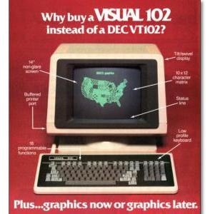
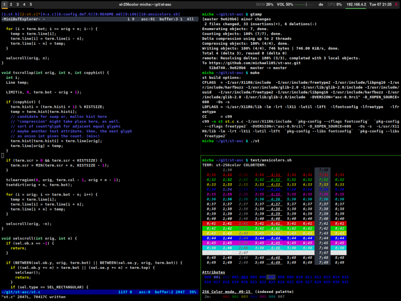
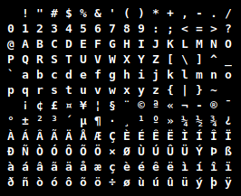

## slterm - slim terminal

	Slim (94kB linked shared) and fast terminal emulator for X11,
	with minimal external dependencies (Xlib and Xft).
   Descendant of st (suckless terminal), modified extensively.

##### Addons and modifications:

   * Lessmode: scroll around with less like keybindings
   * Hit shift+backspace: enter 'lessmode', and scroll
      back to the line the last command has been entered in the shell
   * Scrollmarks: Set bookmarks to scroll back and forward
   * Hotkeys for changing font size, -spacing and inverting colors
   * Inline help (reference of the bound keys) 
   * Switching codepages with hotkeys (cp437,cp850,cp1252,..)
   * Input translation of unicode / X Keysyms to the current codepage
   * Several performance and memory related modifications;
     slterm might be the fastest available terminal emulators for X
   * secure mode, option -X: lock all pages into memory, prevent swapping
	* Gradient custom color palette for colors 0..16 
	  (and 0..7, with attributes normal, bold, faint, bold_faint)

Statically linked binary, with all runtime dependencies (3.5M)
[https://codeberg.org/misc1/-/packages/generic/slterm/0.98](https://codeberg.org/misc1/-/packages/generic/slterm/0.98)

---

#### Additions

##### Lessmode

  * `Ctrl+Shift+l/PageUp/CursorUp` to enter "lessmode".
		
	Afterwards in "lessmode" Cursor keys and PageUp/Down scroll around.

  * `q` or `Escape` leave lessmode.

  * `Shift+Return` to execute a command in the shell and automatically enter lessmode,
       	if more than one screen is written by the command.

  * `Shift+Backspace`: Enable lessmode and scroll back to the location, 
		   the last command was entered.
   
<!--  -->
	 
##### Scrollmarks: Bookmarks within the history.

	set mark:   Ctrl+Alt+n (n=0..9)
	goto mark:  Ctrl+n
	(lessmode): 'n' (number without modifier)

##### Hotkeys for font sizes and colors:
  
 - `Alt+Shift+Insert/Delete`   Enlarge/Shrink font width
 - `Alt+Shift+PageUp/PageDown` Zoom font in / out
 - `Alt+Shift+Home`            Reset to default font size.
 - `Ctrl+Shift+I`              Inverse colors
   

##### Different charmaps, assigned to hotkeys
 
 per default CP1252 ( ANSI, ISO 8859-1, DEC-MCS(nearly) ) is used,
 and only the first page. (0x20-0xff), "extended ascii", ansi.

 CP437 (IBM-PC1, et al., with those signs to draw borders and boxes),
 cp850, cp1250, cp1251, cp1253 are compiled in, 
 and can be selected by Ctrl+Win+[0..5]
 Other codepages would be possible, by adding them to charmap.h,
 and edit config.h

 All tables are used with 8bit ascii, for performance reasons.

 Keyboard input is translated to the current charmap.
 
 UTF8 is abandoned for now, but the code for utf8 is left in the sources.

##### Colors

  The default 7 colors, with additional 3 attributes bold, faint and bold_faint 
  ( so there are 32 colors ) are configured as color gradients.
  Configurable in config.h

  The 256 colors map follows the xterm standard, with the difference 
  of more contrast with faint and bold_faint attributes.

  Truecolor is there as well.(Albite this might be a strange bug. Dunno. 
		  I'm sort of fed up with the codebase. Should have had rewritten that,
		  instead of using the code as base. Sry. Starting with all those globals,
		  undocumented, having several thousand lines within one source file,
		  doing strange undocumented pointer stuff all the time - this is not "suckless".)
  Sry. I'nm just a little bit frustrated.
	

##### Inline help

`Ctrl+F1`
   
    Show the (outdated) reference of keybindings
    `Anymod` can be any combination of modification keys (Ctrl, Alt,..)
    Added to show the internal help, also when e.g. F1 has been
	 bound to the window manager

  
   
	Cursor and configurable cursorcolor for unfocused windows,
	cursor gets highlighted on focus in

#### Slim resource usage:

  Colors restricted to a 256 color palette 
        (Saving 6 Bytes per Glyph)

	Keep the history and terminal contents on resize events
		(Doesn't erase wider lines, when shrinking)
		No scrollback "behind" the current history anymore (Bugfix)

	Delayed allocation of the history buffer. 

		Saves up to tenths or even hundreds of MB, 
		depending on the terminal's width and history size

___

The sourcecode is heavily modified, partly rewritten, and split into 
smaller parts. (Original it has been one single file with several thousand lines).

___

Applied 'official' patches:

- anysize
- clipboard
- keyboard_select
- relative_border
- scrollback
- scrollback-mouse
- scrollback-mouse-increment
- selectioncolors
- xresources  
		added commandline switch -x to enable reading the xresources, 
		compile time switch "XRESOURCES"

Further info is in [slterm.1](src/slterm.1.rst), [Patches](PATCHES.md) and [LOG.md](LOG.md)

### About

(A screenshot of i3 and 3 instances of slterm)

    Stripped unicode support in favour of the 256 chars (extended) ASCII table
        utf8 is an optional compiletime switch now.(was).
        (Most programs suddenly handle German Umlauts, etc.pp out of the box, using the ASCII table / CP1250 only.
        E.g. bash, vi, .. What is an interesting result. st has a quite good unicode handling,
        but until yet I always needed to dive into the configurations for 
        entering chars like ä,ö,ß in unicode mode)

        Besides, instead of having a history buffer, which needs 15 Bytes per Glyph 
        (a Glyph is a char on the screen with text attributes and colors)
         - now each Glyph is 4 Bytes. What can be nicely optimized.

"256" colors (with attributes faint, normal, bold) and the ascii table without control characters as displayed by slterm. 
The scripts for creating the output are within ./test

.. Did split the sourcefile (one big file with several thousand lines)
into smaller pieces. Hopefully hacking st is in the future a little bit more conveniant. 

---

### Requirements for compiling

- Xlib headers
- Xft headers
- pkgconf (pkgconfig)

### Install

edit [config.make](config.make) (optionally) 
edit [src/config.h](src/config.h) (optionally) 

    make
    make install

The default configuration might be save. 

(no utf8, scrollback history 16384 lines, no XResources, installs into /usr/local/bin)

If you'd like to change anything, please edit config.h and config.make

### Links

		
* About utf8 

 	<http://doc.cat-v.org/bell_labs/utf-8_history>

	
* A comparison on latency, speed and memory consumption of
	different terminal emulators. st and urxvt standing out.

  <https://anarc.at/blog/2018-05-04-terminal-emulators-2/>

	
* Latency. 

	<https://danluu.com/term-latency/>

 	
* Latency, comparing old (1980) and nowadays systems.

	<https://danluu.com/input-lag/>
	

### Bugs

The history ringbuffer could get problematic and scroll to wrong locations in conjunction with the scrollmarks when circled. (atm, the default history has 65536 lines, so this is not at the top of the todo list)

UTF-8 currently might need some work.
Me, I don't need it. And I don't really like the idea of having up to 4 Bytes per Rune.
It's quite simple to add another chartable, if needed, and
im- and export files via tools/cpfilter or iconv. 

Crashes sometimes under unknown circumstances when using the alternate screen mode. (man pager, less)

====================

(misc 2020-2023 - misc xx  at posteo.net / replace xx with 4+3 )

Credits
-------

Based on Aurelien APTEL <aurelien dot aptel at gmail dot com> bt source code.

Fetched from the suckless git repo (suckless.org) on 2020/01/01.

Please see for the authors of the patches [PATCHES](PATCHES.md)

(My apologies for not pushing the work back to suckless,
but the heavy changes and the not so simple additions
let me seem this neither easy nor following the suckless philosophy;
and it wouldn't be possible to submit "patches" anymore)

