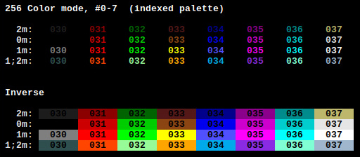

## slterm - slim terminal

	Slim (124kB linked shared) and fast terminal emulator for X11,
	with minimal external dependencies (Xlib, fontconfig and freetype).
   Descendant of st (suckless terminal), modified extensively.

	VTxxx compatible.

	Finally getting close to a first "stable" release.
	Only things missing (imho) are history search and storing.
	Should run stable, please open issues for any crashes.
	
	The statically linked binary (slterm_linux_amd64) in "releases" should work for every 
	64bit linux with a running xorg xserver, and (surprisingly) doesn't need more
	memory than the shared executable.

	Ram usage with an empty history buffer is about (virtual) 6MB + (resident) 4MB.
	

##### Features

   * Lessmode: scroll around with less like keybindings
   * Shift+Backspace: enter 'lessmode', and scroll
      back to the line the last command has been entered in the shell
	* Retmarks: Tab/Backspace to jump in lessmode to the locations of entered commands
   * Scrollmarks: Set bookmarks to scroll back and forward
   * Hotkeys for changing font size, -spacing and inverting colors
   * Inline help (reference of the bound keys) 
   * Switching codepages with hotkeys (cp437,cp850,cp1252,..)
   * Input translation of unicode / X Keysyms to the current codepage
   * Several performance and memory related modifications;
     slterm should be the fastest available terminal emulator for X,
     which does real scrolling 
   * secure mode, option -X: lock all pages into memory, prevent swapping
   * Gradient custom 32 color palette for colors 0..7
     (0..7 with attributes normal, bold, faint, bold_faint)
     and the first 16 background colors
   * Copy whole lines in the history with 'yy' in selection mode
   * Additional cursor shapes
   * utf8 clipboard conversion

Statically linked binaries with all dependencies are under "releases", 
or at
[https://github.com/michael105/static-bin/](https://github.com/michael105/static-bin)

The latest development statically linked binary is named slterm_version.devel

An ubuntu (debian) package is online at [github/actions/build_package](https://github.com/michael105/slterm/actions/workflows/build_package.yml) 
(last workflow run -> Artifacts) 

---

#### Additions

##### Lessmode

  * `Alt+Shift+l/Up/Down/PageUp/PageDown` to enter "lessmode".
		
	Afterwards in "lessmode" Cursor keys and PageUp/Down scroll around.

  * `q` or `Escape` leave lessmode.

  * `Shift+Return` to execute a command in the shell and automatically enter lessmode,
       	if more than one screen is written by the command.

  * `Shift+Backspace`: Enable lessmode and scroll back to the location, 
		   the last command was entered.

  * `Tab`, `Tab left`: Jump back and forth to the locations, commands had been entered.
   
<!--  -->
	 
##### Scrollmarks: Bookmarks within the history.

	set mark:   Ctrl+Alt+n (n=0..9)
	goto mark:  Ctrl+n
	(lessmode): 'n' (number without modifier)

	retmarks:  the positions within the terminal history is saved for
              every line, entered with return.
				  Go back: Shift+Backspace
				  cycle (in lessmode): tab left/right, backspace

##### Hotkeys for font sizes and colors:
  
 - `Ctrl+Shift+Insert/Delete`   Enlarge/Shrink font width
 - `Ctrl+Shift+Home/End`        Enlarge/Shrink font height
 - `Ctrl+Shift+PageUp/PageDown` Zoom font in / out
 - `Ctrl+Shift+Backspace`       Reset to default font size.
 - `Ctrl+Shift+I`               Inverse colors
   

##### Different charmaps, assigned to hotkeys
 
 per default CP1252 ( ANSI, ISO 8859-1, DEC-MCS(nearly) ) is used,
 and only the first page. (0x20-0xff), "extended ascii", ansi.

 CP437 (IBM-PC1, et al., with those signs to draw borders and boxes),
 cp850, cp1250, cp1251, cp1253 are compiled in, 
 and can be selected by Ctrl+Win+[0..5]
 Other codepages would be possible, by adding them to charmap.h,
 and edit config.h

 All tables are used with 8bit ascii, for performance reasons.

 Keyboard input is translated to the current charmap.
 
 UTF8 is abandoned for now, but the code for utf8 is left in the sources.

##### Colors

  The default 7 colors, with additional 3 attributes bold, faint and bold_faint 
  ( so there are 32 colors ) are configured as color gradients,
  configurable in config.h

  The 256 colors map follows the xterm standard, with the difference 
  of more contrast with faint and bold_faint attributes.

  Combining blink and inverse attributes does blinking by reversing. (wonderful)
  > echo -e '\e[48;5;9;32;1;6;7m\n\n BLINK \n' 

##### Inline help

`Ctrl+F1`
   
    Show inline help, and the reference of keybindings
   
	Cursor and configurable cursorcolor for unfocused windows,
	cursor gets highlighted on focus in

___

The sourcecode is heavily modified, partly rewritten, and split into 
smaller sections. (Originally it had been one single file with several thousand lines).

___

Applied 'official' patches:

- anysize
- clipboard
- keyboard_select
- relative_border
- scrollback
- scrollback-mouse
- scrollback-mouse-increment
- selectioncolors
- xresources  
		added commandline switch -x to enable reading the xresources, 
		compile time switch "XRESOURCES"

Further info is in [slterm.1](src/slterm.1.rst), [Patches](PATCHES.md) and [LOG.md](LOG.md)

### About

(A screenshot of i3 and 3 instances of slterm)

    Stripped unicode support in favour of the 256 chars (extended) ASCII table
        utf8 is an optional compiletime switch now.(was).
        (Most programs suddenly handle German Umlauts, etc.pp out of the box, using the ASCII table / CP1250 only.
        E.g. bash, vi, .. What is an interesting result. st has a quite good unicode handling,
        but until yet I always needed to dive into the configurations for 
        entering chars like ä,ö,ß in unicode mode)

        Besides, instead of having a history buffer, which needs 15 Bytes per Glyph 
        (a Glyph is a char on the screen with text attributes and colors)
         - now each Glyph is 4 Bytes. What can be nicely optimized.

"256" colors (with attributes faint, normal, bold) and the ascii table without control characters as displayed by slterm. 
The scripts for creating the output are within ./test

.. Did split the sourcefile (one big file with several thousand lines)
into smaller pieces. Hopefully hacking st is in the future a little bit more conveniant. 

---

### Requirements for compiling

- make
- gcc
- Xlib 
- Xft 
- freetype2
- pkgconf (pkgconfig)
- optional, to embed resources: rst2man, xdd (comes with vim)

For ubuntu : 'sudo apt-get install libfreetype-dev x11proto-dev fontconfig libx11-dev libxft-dev python3-docutils vim' 

### Install

edit [config.make](config.make) (optionally) 
edit [src/config.h](src/config.h) (optionally) 

    make
    make install

The default configuration might be save. 

(no utf8, scrollback history 65536 lines, no XResources, installs into /usr/local/bin)

If you'd like to change anything, please edit config.h and config.make

### Links

		
* About utf8 

 	<http://doc.cat-v.org/bell_labs/utf-8_history>

	
* A comparison on latency, speed and memory consumption of
	different terminal emulators. st and urxvt standing out.

  <https://anarc.at/blog/2018-05-04-terminal-emulators-2/>

	
* Latency. 

	<https://danluu.com/term-latency/>

 	
* Latency, comparing old (1980) and nowadays systems.

	<https://danluu.com/input-lag/>
	

### Bugs

Switching back and forth from alt screen does reset the cursor position,
but doesn't clear the screen for remote ssh sessions.

Retmarks aren't accurate for every 65536 lines.

No UTF8
UTF-8 currently would need some work,
stripped for performance reasons.

Xresources, untested for a while. Currently colors are not used.

#### fixed:

crashes with the alt screen
corrected ret marks and scrollmarks

====================

(misc147 2020-2025 - github.com/michael105)

Credits
-------

Based on Aurelien APTEL <aurelien dot aptel at gmail dot com> bt source code.

Fetched from the suckless git repo (suckless.org) on 2020/01/01.

Please see for more information on the authors of the patches [PATCHES](PATCHES.md)
(Tonton Couillon, dcat,  Jochen Sprickerhof, M Farkas-Dyck, Ivan Tham, 
 Ori Bernstein, Matthias Schoth, Laslo Hunhold, Paride Legovini, Lorenzo Bracco, 
 Kamil Kleban, Avi Halachmi, Jacob Prosser, Augusto Born de Oliveira, 
 Kai Hendry, Laslo Hunhold, Matthew Parnell, Doug Whiteley, Aleksandrs Stier, 
 Devin J. Pohly, Sai Praneeth Reddy)

My apologies for not pushing the work back to suckless,
but the heavy changes and the not so simple additions
let me seem this neither easy nor following the suckless philosophy;
and it wouldn't be possible to submit "patches" anymore.

