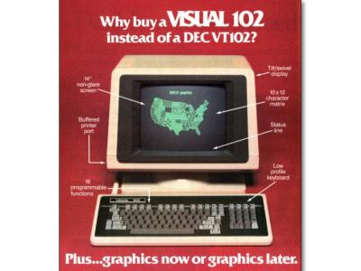

## slterm - slim terminal


	Slim (100kB) and fast terminal emulator for X11.

	Based on a patched version of st (suckless terminal).

	Addons and modifications: 


       * Lessmode: scroll around with less like keybindings
	    * Hit shift+backspace: enter 'lessmode', and scroll
 	      back to the line the last command has been entered in the shell
       * Scrollmarks: Set bookmarks to scroll back and forward
		 * Hotkeys for changing font size and spacing
		 * Inline help (reference of the bound keys) 
		 * Several performance and memory related modifications;
		   I claim slterm being the fastest available terminal emulator for X

		

	Since I did split the single big source file into several smaller units,
	and made quite extensive modifications, I guess it would (sadly) neither be easy
	nor senseful at all trying to push the changes upstream again.
	The addons like lessmode also somehow do not fit to the suckless philosphy anymore,
	(Albite I'm questioning the idea to have a single source file with 2700 lines anyways..)

---

##### Additions:


	Lessmode

		Hit Ctrl+Shift+PageUp/CursorUp to enter "lessmode".
		Afterwards in the 'lessmode' Cursor keys and PageUp/Down scroll around.
		Ctrl+Shift+PageDown/CursorDown, 'q' or Escape leave the lessmode.

 		Hit Ctrl/Shift+Return to execute a command in the shell and automatically enter lessmode,
       	if more than one screen is written by the command.

		Shift+Backspace: Enter lessmode and scroll back to the place, the last command has been entered.
   
	 
	Scrollmarks: Bookmarks within the history.

		set:  Ctrl+Alt+n (n=0..9)
		goto: Ctrl+n
		in lessmode: 'n' (number without modifier)


	Delayed allocation of the history buffer. 

		Saves up to tenths or even hundreds of MB, 
		depending on the terminal's width and history size

   
	Cursor and configurable cursorcolor for unfocused windows,
	cursor gets highlighted on focus in


##### Slim resource usage:

	UTF8 support is an optional compile switch now.
	  

  Colors restricted to a 256 color palette 
        (Saving 6 Bytes per Glyph)

	Keep the history and terminal contents on resize events
		(Doesn't erase wider lines, when shrinking)
		No scrollback "behind" the current history anymore (Bugfix)


___

Applied 'official' patches:

<!--  -->

- anysize
- clipboard
- keyboard_select
- relative_border
- scrollback
- scrollback-mouse
- scrollback-mouse-increment
- selectioncolors
- xresources <br>
		added commandline switch -x to enable reading the xresources,<br>
		compile time switch "XRESOURCES"


Further info is in [slterm.1](src/slterm.1.rst), [Patches](PATCHES.md) and [LOG.md](LOG.md)

---

### Requirements for compiling

- Xlib headers
- Xft headers
- pkgconf (pkgconfig)

### Install

edit config.h.in (optionally)

```
make
make install
```
The default configuration might be save. 

(no utf8, scrollback history 16384 lines, no XResources, installs into /usr/local/bin)

If you'd like to change anything, please edit config.h.in.

---

### About


(A screenshot of i3 and 3 instances of slterm)


    Stripped unicode support in favour of the 256 chars (extended) ASCII table
        utf8 is an optional compiletime switch now.
        (Most programs suddenly handle German Umlauts, etc.pp out of the box, using the ASCII table / CP1250 only.
        E.g. bash, vi, .. What is an interesting result. st has a quite good unicode handling,
        but until yet I always needed to dive into the configurations for 
        entering chars like ä,ö,ß in unicode mode)

        Besides, instead of having a history buffer, which needs 15 Bytes per Glyph 
        (a Glyph is a char on the screen with text attributes and colors)
         - now each Glyph is 4 Bytes. What can be nicely optimized.

Unicode encoding needs 4 Bytes per char within st,
and I nearly never need unicode chars in the terminal.

Same for rgb colors. Stripping them of st spares 6 Bytes per Glyph.

Before the changes every Glyph needed 15 Bytes,
now it's 4 Bytes. I personally prefer having a quite big (10.000 lines or more)
scrollback buffer, so this is a factor.
Resulting in a faster and more responsive terminal emulation.


>(..I'd propose, unicode isn't needed for system administration/
development at all. You are going to get into all sort of troubles,
when, e.g., you'd be naming files and directories in the root fs
using unicode characters. Furthermore, let's assume, there are, say,
100.000 instances of st running. Now, on the world. Multiply this
with, umm, 10 MB, multiply with cpu cycles of 100.000 (swapping, and so on),
and . It's not theorethical anymore. Ok. The calculation might be a little bit wrong,
Admittedly, you shouldn't multiply memory and cpu cycles.
Anyways, my point is valid. And there is the computing time to add,
generated by typos. Adding a unicode character in the wrong script could create.. uuh
never mind. But it's a good reason to stick to KISS (keep it simple, stupid..) principles. 
Murphy's law will strike, anyways. That's the law..)


So, in my quest to slim down all programs I'm using,
I'm about to strip unicode and utf8 support.

Yet I managed to get a virtual memory footprint of around 8MB.
Ok. Added all patches, and with the current history of 10k lines,
it's at 12MB.
(>20MB before)
I'm always keeping more than 10 terminals open,
so that sums up. 
Every Glyph (char at the screen, with attributes and colors) now
needs 4 Bytes. ( 15 Bytes before stripping unicode and rgb)


The smaller memory footprint also pays out in a more responsive
system overall, improving st's speed as well. (3x here) Ok.
I tried hard, to get "benchmarks", the removed unicode support
doesn't profit of. Still, this shows up with a gain of 2x.

I checked several emulators, closest in terms of performance would be 
urxvt. However, testing and comparing more, the speed of urxvt is given
by a (neat) trick. When dumping many chars into the terminal, eg. with cat,
the screen doesn't show every single character. It's more sort of an animation,
showing only enough chars to give the perception of a continous scrolling
terminal. When confronted with, e.g., a `dd if=data bs=1000`;
this cheat doesn't work anymore, dumping the data takes (depending on the size, etc)
up to 20times longer. 
st seems to be the fastest terminal emulator available. 


The (pseudo) rgb color support is stripped.
Saving 6 Bytes per glyph.
There still is the option to
have "rgb" colors via modifying the indexed 256 color palette, 
the default is the ("standardized") xterm 256 color palette.
I just slimmed down the memory usage for the colors from 8 Bytes to 2 Bytes per glyph.


;) To quote Bill, 256 colors ought be enough for everyone.
(Am I confusing something..?..)


"256" colors (with attributes faint, normal, bold) and the ascii table without control characters as displayed by slterm.<br>
The scripts for creating the output are within ./test


.. Did split the sourcefile (one big file with several thousand lines)
into smaller pieces. Hopefully hacking st is in the future a little bit more conveniant. 
There still are many globals spread over the
different source files. I'm about to tidy this up further.


### Links


		
* About utf8 

 	<http://doc.cat-v.org/bell_labs/utf-8_history>


	
* A comparison on latency, speed and memory consumption of
	different terminal emulators. st and urxvt standing out.

  <https://anarc.at/blog/2018-05-04-terminal-emulators-2/>


	
* Latency. 

	<https://danluu.com/term-latency/>


 	
* Latency, comparing old (1980) and nowadays systems.

	<https://danluu.com/input-lag/>
	


### Bugs

Clipboard copy/paste of characters > 127 currently doesn't communicate correctly
with Xorg programs. 

The history ringbuffer could get problematic in conjunction with the scrollmarks when circled. (atm, the default history has 65536 lines, so it's not at the top of the todo list)


====================


(misc 2020,2021 - misc.myer@zoho.com )


Credits
-------

Based on Aurelien APTEL <aurelien dot aptel at gmail dot com> bt source code.

Fetched from the suckless git repo (suckless.org) on 2020/01/01.

Please see for the authors of the patches [PATCHES](PATCHES.md)


